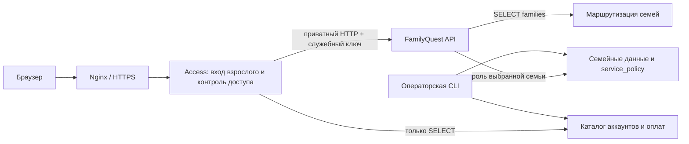

# Сервис доступа FamilyQuest

С версии 0.2.0 SaaS можно разворачивать как два отдельных Go-процесса/контейнера: `familyquest-access` и `familyquest-api`. Код остаётся в одном репозитории. Домашний режим и прежний SaaS без прокси сохраняются для совместимости, но не используются одновременно с защищённым core.

## Границы ответственности

| Компонент | Ответственность |
| --- | --- |
| Access | Проверка email/пароля взрослого, ограничение попыток входа, проверка действующей сессии через introspection, статуса семьи и срока доступа, публичный `/api/subscription`, проксирование разрешённых запросов |
| Core | Подпись JWT, PIN профилей, привязанные устройства, session_version и отзыв сессий, родительское подтверждение, роли участников, изоляция семьи и предметные ограничения |
| Operator | Подключение семьи, восстановление аккаунта, реестр, ручное подтверждение оплаты/возврата, аудит, миграции и выдача SQL-прав |

Access не получает `SESSION_SECRET`, членство в семейных SQL-ролях или чтение семейных таблиц. Core не читает пароли аккаунтов и платежи; доступен только каталог маршрутизации `families` и семейные схемы. Перед стартом оба процесса проверяют ограничения runtime-ролей.

Аутентификация взрослого вынесена в Access. Проверка семейной сессии делегируется Core: это сохраняет текущие JWT, PIN, устройства и немедленный отзыв через session_version. Каждому запросу к данным предшествует приватная introspection без кэширования. Core повторяет проверку сессии и предметных прав. Изменение подписки между двумя проверками не позволяет обойти ограничения записи в application-слое.

При недоступности Core/проверки доступа шлюз возвращает 503, а не пропускает запрос. Истёкшая подписка сохраняет чтение истории/экспорт и завершение начатой математики; новая запись блокируется. Приостановленная семья не получает доступа. Лимит активных детей проверяется транзакционно внутри приложения, включая импорт.

## Контракты и защита

Публичные URL, JSON входа, cookie и Bearer-токены совместимы с 0.1.4. `/api/version` возвращает прежние поля Core плюс объект `access` с версией/commit/build/start; `/api/access/version` показывает только Access. Интерфейс отображает оба сервиса и свою сборку.

Приватные маршруты Core:

- `GET /api/__access/introspect`: проверенная principal и локальная подписка; принимает существующую сессию.
- `POST /api/__access/account-session`: выдаёт сессию взрослого для проверенных Access `familyId` и `participantId`; отзывает прежнее запомненное устройство.

Core требует `X-FamilyQuest-Access-Key` для всех маршрутов кроме GET health. Это credential сервиса, не браузера. Access удаляет входящие служебные заголовки и выставляет собственный ключ; приватные маршруты и неоднозначные пути извне закрыты. ReverseProxy использует Rewrite (после удаления hop-by-hop заголовков), поэтому Connection не может удалить добавленный ключ. Правила CSRF сохраняются. Секреты и токены не пишутся в логи.

Compose изолирует сети: `web ↔ access` (edge), `access ↔ core` (core), процессы ↔ PostgreSQL (data). Web не подключён к core/data. Alias `api` в edge указывает на Access для совместимости Nginx; приватный origin — `familyquest-core:8081`. API/Access/PostgreSQL не публикуют порты хоста. Health Access проверяет собственную БД и Core.

Служебный ключ предназначен для частных Docker-сетей одного доверенного хоста. Для нескольких хостов нужны TLS/mTLS и управление идентичностями/ротацией секретов. Rate limit пока локальный в памяти процесса: несколько реплик требуют общего ограничителя. Двойная проверка сессии добавляет обращения к БД; перед масштабированием нужны измерения нагрузки.

## Данные биллинга и следующий этап

Это выделенный сервис исполнения доступа, но **не отдельная физическая БД биллинга**. PostgreSQL пока общий, права разделены. Оператор записывает платёж/возврат и проекцию `service_policy` в одной транзакции. `paid` означает подтверждённый текущий платёж; `access` — разрешённый доступ, который может быть бессрочным для ранее подключённой домашней семьи.

Платёжный провайдер, webhook, самостоятельная регистрация и кабинет оператора не добавлены этим выделением. При подключении провайдера проверка подписи, идемпотентный журнал событий и сверка должны находиться на стороне сервиса аккаунтов/биллинга. Для отдельной БД нужен transactional outbox и идемпотентное применение версионированных entitlement-событий в Core; прямой сетевой dual-write недопустим. Миграция на YDB этим релизом не выполняется; см. [оценку облака](yandex-cloud.md).

## Включение на существующем SaaS

Требуется Docker Compose 2.24.4+ (поддержка `!override`). До переключения сохранить полный dump, роли/grants, `.env` и предыдущие образы; проверить восстановление. Сохранить прежний SESSION_SECRET, URL и cookie domain. На время изменения прав остановить web/API, чтобы старый API не работал с уже урезанными правами.

1. Собрать backend нового релиза. Оператор запускается из этого образа с отдельным административным DATABASE_URL и доступом к PostgreSQL.
2. Создать `familyquest_access` LOGIN NOINHERIT без superuser/CREATEROLE/CREATEDB/BYPASSRLS и членств. Назначить случайный пароль безопасным способом. `grant-access` принимает `{"Role":"familyquest_access"}`.
3. Для существующей runtime-роли API выполнить `grant-core` с `{"Role":"familyquest_runtime"}`. Команда атомарно отзывает чтение accounts/payments и сохраняет необходимые семейные роли. После provision новой семьи повторять **grant-core**, не grant-runtime.
4. Добавить в защищённый `.env` `ACCESS_DATABASE_URL` (каталожная роль) и случайный `ACCESS_SHARED_SECRET` длиной минимум 32 символа. Секрет не передавать в frontend/аргументах команд/логах. Сохранить административный URL отдельно от runtime-конфигурации.
5. Создать пустой `.access-proxy-enabled` в корне production checkout. Маркер исключён из Git; `scripts/update-home.sh` автоматически подключит overlay при следующих обновлениях.
6. Запустить обновление выбранного аннотированного release tag. Эквивалент конфигурации: `docker compose -p familyquest -f docker-compose.prod.yml -f docker-compose.access.yml up --build -d --wait`. После переключения оператор использует сеть `familyquest_data` вместо прежней `familyquest_default`.
7. Проверить health всех трёх процессов, версии, вход, чтение своей семьи, отказ прямого запроса к Core без ключа и отсутствие SQL-прав на чужой компонент. Проверить недоступность приватных маршрутов снаружи. Без входа данные должны возвращать 401.

Не запускать обычный compose без overlay на установке с включённым маркером. Не включать домашний режим для обхода ошибки.

## Откат

Остановить внешний трафик. Для возврата к прежнему SaaS без прокси оператором выполнить `grant-runtime` для роли Core, восстановить прежнюю `.env`, убрать маркер и запустить прежние проверенные API/Web образы с базовым compose. Сохранить SaaS=1, SKIP_MIGRATIONS=1 и прежний SESSION_SECRET. Удалить только ставший ненужным контейнер Access; не удалять PostgreSQL volume. В этом релизе нет миграций данных, поэтому штатный откат не требует откатывать семейные данные или платежи. При аварийном восстановлении использовать согласованный dump вместе с ролями/grants.

## Проверки

Go integration с настоящим PostgreSQL создаёт две семьи и две ограниченные runtime-роли: проверяет вход/изоляцию, cookie, отзыв после reset-account, возврат оплаты, блокировку семьи и отказ SQL за границами роли. HTTP-тесты проверяют приватные пути, поддельные заголовки, точные исключения при истечении и fail-closed при отказе origin. `scripts/check-access-compose.sh` дополнительно проверяет реальную топологию контейнеров на отдельном одноразовом проекте.
