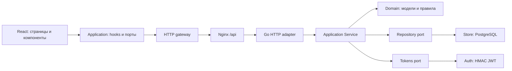

# Архитектура FamilyQuest

Одна установка обслуживает одну семью. Изоляции нескольких семей, арендаторов и организаций нет.

## Поток данных

Стрелки в диаграмме показывают вызовы во время выполнения. Направление импортов отличается: реализация `store` зависит от контрактов `application` и моделей `domain`, а `application` не импортирует `store`, `auth` или `httpapi`.

## Backend

| Слой | Ответственность |
| --- | --- |
| `internal/domain` | Модели, роли, проверки входных значений и переходов семейных сценариев |
| `internal/application` | Сценарии, права изменения, порты Repository/Tokens, контракт backup |
| `internal/store` | SQL, транзакции, миграции, bcrypt, проекции и согласованный экспорт |
| `internal/auth` | Выпуск и проверка HMAC-SHA256 JWT |
| `internal/httpapi` | HTTP-маршруты, Bearer, JSON, ограничения размера, преобразование ошибок |
| `cmd/api` | Сборка зависимостей, запуск, завершение по сигналу |

Use case получает `domain.Principal`; автор операции извлекается из токена. Parent-права проверяются и на HTTP-маршруте, и в изменяющем use case. Токен дополнительно сверяется с активным участником, его текущей ролью и версией сессии. Смена PIN и импорт backup увеличивают версию и отзывают старые сессии. Новый JWT нужен и после истечения TTL или смены `SESSION_SECRET`.

Оценить выполнение может взрослый, который не является исполнителем. В SQL подтверждение допускается для `completed`/`confirmed`, строка блокируется до commit. Исполнитель отмечает только собственную задачу. Роли `parent` и `child` могут оценивать поведение других участников; существующая роль `school` имеет более ограниченные права. Подробная матрица — в [API](api.md).

Миграции сериализуются PostgreSQL advisory lock, каждая применяется в транзакции и записывается в `schema_migrations`. Уже применённые SQL-файлы не редактируются. Миграция 004 добавляет версию сессии; старые токены без `ver` совместимы с версией 0 до первого отзыва.

## Frontend

`main.tsx` создаёт `RuntimeContext` с реализациями gateway, session и backup. Application hooks получают зависимости через контекст. HTTP-пути, JSON, Authorization и sessionStorage находятся в infrastructure. Presentation-компоненты работают с доменными моделями, действиями и состоянием.

Сессия подписывается через `useSyncExternalStore`. Защищённый ответ 401 очищает именно ту сессию, с которой отправлялся запрос. Запоздалый ответ старой сессии не удаляет новую; неуспешный вход при переключении пользователя также её не удаляет. Загрузки защищены от ответов предыдущей даты, пользователя и от обновления после выхода/размонтирования.

Домен frontend не зависит от React, HTTP и storage. Application использует React hooks как механизм состояния: это сознательная адаптация Clean Architecture для React, а не независимая от UI-фреймворка библиотека сценариев. Контракты backup используют браузерный `File` на границе клиентского приложения.

## Данные и ограничения

PostgreSQL — единственное постоянное хранилище приложения. В sessionStorage браузера находятся только текущая сессия и данные выбранного участника. Семейные карточки хранятся в JSONB с версией для optimistic locking; фото/аудио входят в их данные. Экспорт скачивается на устройство пользователя. Автоматического внешнего резервирования, репликации и георезервирования проект не настраивает.

JSON-backup экспортируется из единого repeatable-read snapshot. Импорт полностью заменяет прикладные данные в одной транзакции, проверяет формат и требует активного взрослого. Ошибка откатывает замену. PIN и bcrypt-хеши не экспортируются: при восстановлении сохраняются только credentials участника с совпадающими ID, именем и ролью. Для пустой установки нужен подготовленный bootstrap с индивидуальными PIN либо полный PostgreSQL backup; подробности в [эксплуатации](operations.md).

Ленивое создание задач выполняется при чтении плана. Это исторический компромисс: GET задач имеет побочный эффект. Ежедневные задачи привязаны к дню, еженедельные — к понедельнику, ежемесячные — к первому числу. Разовая задача создаётся на дату назначения и остаётся в плане до подтверждения. Плановые счётчики рассчитываются по текущим активным назначениям; изменение расписания/базовой стоимости может менять исторические рейтинги. Не следует считать их неизменяемым финансовым журналом.

## Соответствие Clean Architecture

Основное правило направления зависимостей соблюдено и закреплено тестами. Backend application зависит только от domain и стандартных библиотек, frontend application не импортирует infrastructure или presentation.

Сохраняются прагматичные компромиссы: широкий Repository, SQL-проекции рейтингов и расписаний, bcrypt внутри persistence adapter, JSON-теги доменных DTO, React в application hooks, крупный `FamilyQuestWorkspace`. Их дальнейшее разделение оправдано при появлении второго адаптера или роста сценариев; само по себе увеличение числа интерфейсов не исправляет поведение. Архитектура не объявляется полностью независимой от транспорта и UI-фреймворка.

## Математика и журнал наград

`domain/math.go` содержит генерацию примеров, алгоритмы промежуточных действий,
проверку ответов и проекцию текущего задания. `application/learning.go` проверяет
роль ребёнка и обращается к порту `LearningRepository`. PostgreSQL хранит
`math_sessions` с владельцем, настройками, вопросами и последовательностью ответов.
Блокировка участника сериализует создание активного занятия; блокировка занятия
сериализует ответы. Завершение, ответы и начисления сохраняются без клиентских
счётчиков наград. После окончания ответить на новый вопрос нельзя.

`activity_rewards` — неизменяемый журнал с уникальным ключом
`(source, source_key, participant_id)`. Домен выводит кандидатов наград из новых
изменений семейного агрегата; запись агрегата и награды выполняются одной
транзакцией. Математический ответ и бонус тоже атомарны. Спорт ограничен одним
бонусом на дату; отметки привычек и завершённые приключения имеют собственные
ключи. Существующий расчёт рейтинга добавляет эти звёзды и улыбки к наградам за
дела и поведение. Архивирование не удаляет заработанное. Backup v3 сохраняет и
проверяет журнал вместе с занятиями; восстановление проверяет математические
ответы и соответствие их начислений.
