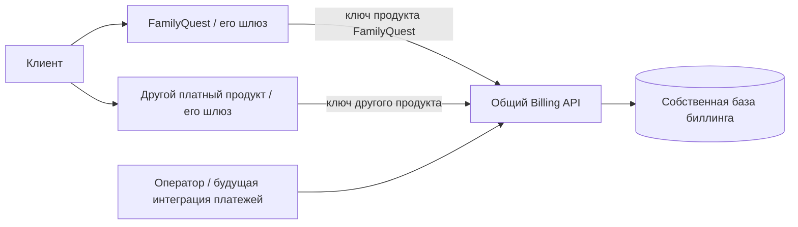

# Универсальный биллинг для нескольких продуктов

Уточнение требований от 27.09.2026. Биллинг должен обслуживать независимые платные продукты; FamilyQuest — первый потребитель. Этот документ фиксирует целевую границу. Выпущенный Access 0.2.0 пока является адаптером FamilyQuest и **не реализует** описанный ниже универсальный биллинг.

## Ответственность

Биллинг учитывает клиентов, продукты, тарифы, подписки, подтверждённые платежи, возвраты и предоставленный доступ. Он отвечает, что оплачено, на какой период, какие функции и лимиты предоставлены. Он не знает, что такое родитель, ребёнок, PIN, школьный профиль, занятие или награда.

Проверка пользовательской личности и единый вход — отдельная ответственность. Биллинг использует стабильный `customerId` и не должен зависеть от конкретного способа входа. Возможность общего аккаунта для продуктов обсуждается отдельно; она не меняет модель оплаты. Доступ к billing API предоставляется доверенным сервисам, а не браузеру по произвольному customerId.

Приложение проверяет пользовательскую сессию, принадлежность к своему рабочему пространству и предметные права. Оно получает решение биллинга для своего продукта и применяет ограничения. Например, FamilyQuest ограничивает число активных детей в транзакции, а другой продукт — число сотрудников или объём хранилища.



Биллинг не обязан проксировать весь прикладной трафик. Общий шлюз может быть потребителем billing API, как и backend приложения. Нельзя переносить в биллинг правила вида «разрешать /api/math/.../finish»: это политика FamilyQuest, а не свойство оплаты.

## Модель

| Сущность | Смысл и граница |
| --- | --- |
| Customer | Клиент-плательщик со стабильным ID; не семейный профиль |
| Product | Независимый платный сервис: `familyquest`, `another-service` |
| Plan / PlanVersion | Тариф конкретного продукта; изменение тарифа не переписывает уже купленные условия |
| Subscription | Доступ клиента к конкретному продукту/рабочему пространству; содержит снимок версии тарифа |
| Product binding | Сопоставление внешнего workspace/tenant ID приложения с подпиской, уникальное внутри продукта |
| Payment | Подтверждённая сумма, валюта, источник, внешний reference, период и назначение; факт оплаты не заменяется булевым флагом |
| Refund | Аудируемый возврат конкретного платежа; повтор обработки не создаёт второй возврат |
| Entitlement | Решение о доступе: продукт, подписка, функции, лимиты, срок, причина и версия состояния |
| Access grant | Явно предоставленный неоплаченный доступ, например сохранённый бессрочный доступ прежней семьи |
| Audit / Outbox | Кто изменил состояние и какие события требуется доставить приложениям |

У одного клиента возможны несколько подписок в разных продуктах и несколько рабочих пространств одного продукта. Платёж за продукт A не включает продукт B. Наборы продуктов возможны только как отдельное явно определённое коммерческое предложение, а не как общий `paid=true` для клиента.

Общие таблицы разделяются ключами продукта и проверками доступа. Создание копии набора таблиц на каждый продукт не является требованием. Уникальные ограничения и внешние ключи должны запрещать привязку тарифа, подписки или платежа к чужому продукту.

## Контракт проверки доступа — проект v1

Приложение отправляет запрос от собственного service identity. Продукт определяется сервером по этому identity; значение из тела запроса не может повысить полномочия. Запрос принимает внешний идентификатор пространства в пределах продукта, сопоставленный при подключении:

```http
POST /v1/entitlements/check
Authorization: Bearer <service credential конкретного продукта>
Content-Type: application/json

{"subjectRef":"workspace-42"}
```

Пример ответа, не фактический production endpoint:

```json
{
  "productId": "familyquest",
  "subscriptionId": "sub_example",
  "subjectRef": "workspace-42",
  "paid": true,
  "access": "active",
  "reason": "confirmed_payment",
  "validUntil": "2026-10-27T00:00:00Z",
  "features": {"learning": true},
  "limits": {"children": 3},
  "revision": 17,
  "evaluatedAt": "2026-09-27T12:00:00Z"
}
```

Имена feature/limit являются данными тарифа, а не встроенными ветвлениями биллинга. Для другого продукта допустимы `users`, `storageBytes` или `projects`; их смысл и применение принадлежат этому продукту. Неизвестный лимит не должен автоматически означать безлимит.

`paid` и `access` независимы: бесплатное предоставление может давать active без платежа, а блокировка — запрещать доступ при наличии оплаченного периода. Плановые состояния access: `active`, `expired`, `suspended`, `not_registered`. Точная HTTP-семантика, схема и совместимость фиксируются при реализации API; этот пример не объявляется работающим контрактом.

## Изоляция и надёжность

- У каждого продукта отдельный service credential с ограничением продукта и операций. Ключ чтения не позволяет регистрировать оплаты или менять подписки. Ротация не требует менять пользовательские пароли.
- Проверяются не только входные productId, но и принадлежность найденной подписки/платежа/тарифа. Публичное приложение не получает доступ к общему реестру клиентов.
- Повтор подтверждённого платежа с тем же scope/reference и теми же данными идемпотентен; изменённый повтор — конфликт. Запись платежа, изменение entitlement и outbox фиксируются одной транзакцией.
- Денежные суммы хранятся целыми минимальными единицами с явной валютой. Разные валюты не складываются. Неподтверждённый платёж не даёт оплаченного доступа.
- Интервалы доступа полуоткрытые: начало включительно, конец исключительно; время UTC. Возврат пересчитывает покрытие оставшимися основаниями доступа, не удаляет историю платежей.
- Приложение применяет только более новую revision проекции. Дубликаты и переставленные события не восстанавливают отозванный доступ. Периодическое сверение исправляет пропущенную доставку.
- При недоступности биллинга нельзя выдавать новые права. Допустимость ограниченного кэша и максимальный срок задержки отзыва задаются явно; неограниченный fallback на старый `paid=true` недопустим.

## Переход от 0.2.0

1. Создать самостоятельный модуль/контейнер и собственную базу биллинга. В его коде и контрактах нет импортов FamilyQuest, familyId, PIN или SQL семейных схем.
2. Реализовать регистрацию продуктов/клиентов/подписок, ручной платёж/возврат, журнал и product-scoped entitlement API. Платёжный провайдер подключается позднее к тому же учёту.
3. Проверить на двух независимых тестовых продуктах: одинаковые локальные workspace IDs не смешиваются; оплата одного не даёт доступ ко второму; его service key не читает и не меняет чужие данные.
4. FamilyQuest подключить отдельным адаптером: family ID сопоставляется с subjectRef; общий лимит `children` преобразуется в локальный child_limit. PIN, JWT профилей, устройства и правила после истечения остаются в FamilyQuest.
5. Перенести существующие платежи с сохранением reference, валют, периодов и возвратов. Прежний бессрочный доступ переносится отдельным неоплаченным grant, а не фиктивной оплатой.
6. `service_policy` становится версионированной проекцией, не вторым источником биллинга. Заменить прямую запись оплат в `fq_platform` на новую операторскую команду/API. Для двух БД использовать outbox и идемпотентное применение, а не несогласованный dual-write.
7. Перед переключением сверить решения старого и нового учёта без изменения пользовательского доступа. Сохранить backup, mapping и возможность отката. После переключения блокировать старый путь изменения оплат, чтобы не возникли два источника истины.

В 0.2.0 перечисленное ещё не сделано: Access читает fq_platform, логин получает семейную сессию через Core, а оплаты и service_policy меняются оператором в общей PostgreSQL-транзакции. Работающий production не следует считать универсальным биллингом до проверки второго независимого продукта.
