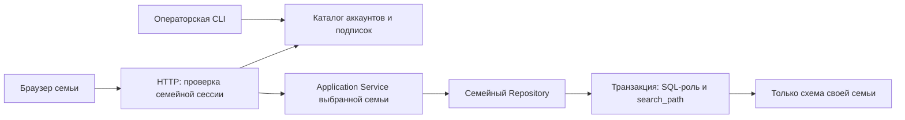

# FamilyQuest: архитектура семейного сервиса

Обновлено 26.09.2026. Реализован включаемый режим закрытого SaaS-пилота. По умолчанию сохраняется домашний режим одной семьи. Включение, миграция и операторские команды описаны в [инструкции](saas-operations.md). [Оценка Yandex Cloud/YDB](yandex-cloud.md) отделена от развёртывания: облачные ресурсы в этой работе не создавались.

## Принятые решения

Модульный монолит Go/React/PostgreSQL сохраняется. Принята модель **подписка на семью с лимитом активных детских профилей**. Взрослые не занимают детские места. Звёзды и улыбки не являются платежами.

Первоначальный проект общей схемы с family_id/RLS заменён на **отдельную схему и SQL-роль на семью** для первого релиза. Это позволяет сохранить текущие SQL-проекции, FK, JSONB и транзакционное восстановление, изолировав их на уровне прав PostgreSQL. RLS и глобальный family_id во всех таблицах в этой реализации не используются.

| Компонент | Реализованная ответственность |
| --- | --- |
| `fq_platform.families` | ID, название, дата регистрации, active/suspended, схема и код тарифа |
| `fq_platform.accounts` | Один взрослый аккаунт-владелец на семью: email, bcrypt пароля, ID родительского профиля |
| `fq_platform.payments` | Подтверждённые оператором платежи: уникальный reference, сумма в минимальных единицах, валюта, период, лимит, полный возврат |
| `fq_platform.audit` | Создание семьи, оплата, полный возврат, блокировка/разблокировка, восстановление аккаунта и оператор |
| `fq_family_N.*` | Участники, дела, задачи, награды, карточки, занятия и устройства конкретной семьи |
| `service_policy` внутри семейной схемы | Лимит детей, срок доступа, неизменяемый обычным parent ID владельца |
| `participants.birth_date/math_level/reading_level` | Дата рождения и независимые настройки предметов |
| `reading_starts` | Временная фиксация разрешённого уровня при старте чтения |

## Изоляция и аутентификация

`POST /api/account/login` проверяет пароль взрослого и открывает семейную сессию. Регистрация выполняется оператором, публичной регистрации без проверки адреса нет. Пароль минимум 12 байт, максимум 72 байта (предел bcrypt); PIN остаётся способом переключения профиля **после** входа в семью. После входа взрослого можно привязать детское устройство с подтверждением родителя.

JWT и подтверждение родителя связаны с familyId. Cookie имеет вид `familyId.secret`: ID используется только для поиска схемы, затем секрет проверяется внутри неё. Подмена префикса не создаёт полномочий. Невалидный bearer не переключает аутентификацию на cookie. Старые токены без семьи в SaaS не принимаются. Активность семьи, профиля, роль и session_version проверяются сервером; при сбросе аккаунта отзываются сессии владельца.

Все семейные маршруты, включая участников, рейтинг и overview, проходят аутентификацию в SaaS dispatcher. Публичны только config, health и вход; logout без сессии безопасно очищает cookie. Прямые application-вызовы с чужим familyId отклоняются; методы чтения используют уже привязанный к семье экземпляр сервиса. Этот экземпляр не является объектом для внешнего произвольного создания: его собирает composition root после разрешения семейной сессии.

Каждый SQL-запрос выполняется в транзакции: `SET LOCAL ROLE` → `set_config(search_path, schema + pg_catalog, true)` → запросы → commit/rollback. Роль семьи не имеет прав на соседние схемы или fq_platform. Имена схем/ролей генерируются каталогом, не приходят из HTTP. Пул общий; настройки снимаются при завершении транзакции. Интеграционные тесты используют один физический коннект для A/B, ошибки и отмены запросов.

Рабочий SQL-пользователь NOINHERIT, без superuser/CREATEROLE/CREATEDB/BYPASSRLS; ему разрешены чтение необходимых таблиц каталога и переключение только на семейные роли. Операторская учётная запись отделена. При `FAMILYQUEST_SKIP_MIGRATIONS=1` SaaS API проверяет атрибуты runtime-роли на старте. Режим запуска с автоматическими миграциями предназначен для локальной проверки, не для production.

Изоляция SQL защищает от ошибочного запроса и семейного пользователя, но не от полного захвата API-процесса, который по своему назначению может выбирать семьи. DB-admin также имеет системный доступ. Роли, адреса и имена схем в системных каталогах не являются секретами.

Frontend размонтирует рабочее пространство при смене пары familyId/participantId. Семейные загрузки проверяют актуальную сессию, старые ответы не попадают в новую семью. При отсутствии сессии в SaaS показывается форма аккаунта, а не данные домашней семьи.

## Возраст и обучение

Родитель редактирует дату рождения и настройки через «Настройки → Возраст и обучение детей». Дата хранится как date, полные годы вычисляются на сервере по Минску. Будущая/невалидная дата отклоняется, неизвестный возраст не выдумывается. 29 февраля в невисокосный год даёт новый возраст 1 марта.

| Возраст | Математика | Чтение |
| --- | --- | --- |
| Не указан / до 8 | easy | phrases |
| 8–9 | medium | sentences |
| 10+ | hard | advanced |

Это начальная продуктовая политика, не образовательный стандарт. Родитель может независимо переопределить оба предмета; ребёнок может выбрать более простой уровень. Столбик включается только явным выбором родителя. Операция и способ ответа остаются отдельным выбором; дефолт — сложение и ввод, без отрицательных чисел. Автопереход по достижениям пока не реализован.

Математическое занятие сохраняет settings/policyVersion при создании под блокировкой профиля; изменение даты/override не меняет уже начатое. Чтение в SaaS сначала вызывает `/reading/start`, фиксирует допустимый уровень, затем завершает тот же ID. Изменение уровня посреди чтения не переписывает этот старт. Одновременно допускается до 20 незавершённых стартов; при новых стартах очищаются записи старше суток. После завершения остаётся идемпотентная награда, временный старт удаляется. Чтение остаётся самостоятельной отметкой практики, без проверки произношения/понимания.

В домашнем режиме прежний выбор уровней сохранён. Возрастная политика применяется к SaaS-профилям; переключить существующую домашнюю семью можно через claim-legacy.

## Подписки и реестр

Новая семья создаётся со сроком доступа «сейчас», то есть без оплаченного доступа. Технический стартовый лимит — 3 ребёнка; это не опубликованный тариф. Операторский платёж указывает фактический лимит и период. CLI `registry` выводит по 100 семей с offset: регистрацию, owner email, статус, тариф, активных детей/лимит, срок, paid/access.

`paid` означает наличие невозвращённого подтверждённого платежа, покрывающего текущий момент. `access` отдельно учитывает срок и блокировку семьи. Присоединённая домашняя семья получает доступ без срока и не становится от этого оплаченной. Денежные суммы разных валют не складываются.

Создание ребёнка сериализуется блокировкой service_policy. Повтор оплаты с тем же reference и теми же существенными полями ничего не продлевает; изменённый повтор возвращает конфликт. Платёж не может сократить уже предоставленный срок или установить лимит меньше числа активных детей. Пропущенные/будущие периоды не выдаются автоматически: для первого релиза приём платежа требует startsAt не в будущем. Полный возврат аудируется; доступ пересчитывается по оставшимся действующим платежам, данные не удаляются.

Истечение проверяется при HTTP-операциях и в изменяющих application-сценариях без cron. История и экспорт доступны; новые действия блокируются. Ответы и завершение уже созданной математики доступны после истечения, но не после блокировки безопасности. Чтение после истечения не начисляет новую награду. Ленивое GET-создание задач при истечении отключается.

Реестром и оплатами управляет CLI с отдельными DB-правами. Веб-кабинет оператора, самостоятельная регистрация, несколько взрослых аккаунтов/membership, приглашения, trial/grace, автоматическое продление, частичные возвраты и webhook платёжного провайдера **пока не реализованы**. Семейные parent-профили не получают операторских прав.

## Backup v6 и миграции

Backup v6 включает familyId, даты рождения/настройки и прежнюю историю. Не содержит аккаунта, пароля, подписки, платежей, устройств, service_policy и аудита. Незавершённые временные старты чтения не экспортируются; заработанные награды сохраняются.

В SaaS импорт допускается только v6 своей семьи и без pinCode. Проверяется лимит детей и сохранение активного владельца; текущие хеши сохраняются только для совпадающих ID/имени/роли. Новые неизвестные credentials из файла не создаются. ID остаются локальными в схеме, поэтому перенумерация не требуется. TRUNCATE действует только на семейные таблицы выбранной схемы; RESTART IDENTITY удалён, sequence выставляются после импорта. Права не позволяют затронуть другую схему или service_policy.

Роль семьи имеет TRUNCATE на свои прикладные таблицы для transactional restore; она не имеет DDL и TRUNCATE на служебную policy. Это сознательно отличается от первоначального проекта общей схемы/RLS. Для системного восстановления нужен полный PostgreSQL backup **и роли/grants**, а не только JSON одной семьи.

Миграции 008/009 добавлены без изменения применённых 001–007. Оператор последовательно мигрирует семейные схемы и обновляет grants. Массовые миграции имеют стоимость O(число семей); модель предназначена для пилота. Для большого числа семей потребуется измерить время миграций, стоимость каталога и решить, сохранять схемы или переносить данные в tenant-key storage.

После включения SaaS возврат к домашнему режиму на той же публичной установке недопустим: он снова откроет legacy endpoints. Переключение выполняется только при остановленном трафике и с проверенным backup. Production в этой работе не переключался.

## До массовых продаж

Нужны подтверждение адреса и самостоятельное восстановление, платёжный провайдер/сверка, операторский веб-кабинет с усиленным входом, квоты медиа/пагинация, распределённый rate limit, нагрузочные испытания, автоматический offsite backup и проверка RPO/RTO. Условия работы с детскими данными, договорные документы и рынок продаж требуют отдельной проверки. Эта версия — проверяемая основа закрытого пилота, не заявление о выполнении всех требований публичного сервиса.
